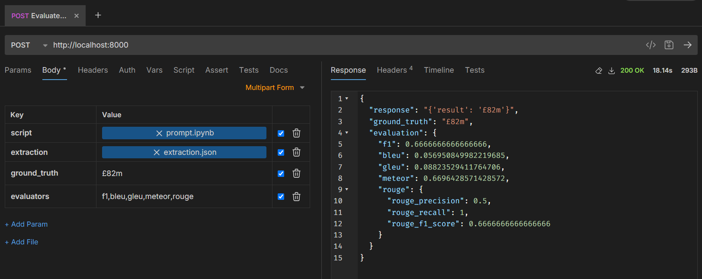

# Evaluation Runtime

A Python execution and evaluation engine that runs Python scripts or Jupyter notebooks against Azure OpenAI endpoints and evaluates the output. It works by dynamically building a sandboxed Docker image, executing it as a Kubernetes job on Azure Kubernetes Service (AKS), and scoring the model response against a supplied ground truth.

## How It Works

The service exposes a single FastAPI `POST /` endpoint. When a request is received:

1. The uploaded script (`.py` or `.ipynb`) is prepared — notebooks are converted to Python scripts via `nbconvert`.
2. The extraction JSON's `content` field is written to a plain text file (`extraction.txt`) for the script to read at runtime.
3. A sandboxed Docker image is built using a boilerplate Dockerfile (in `src/boilerplate/`) that packages the script, extraction file, and an `openai` dependency.
4. The image is pushed to Azure Container Registry (ACR).
5. A Kubernetes job is created on AKS with the Azure OpenAI endpoint and API key injected as secrets.
6. The job runs, and pod logs (the model output) are collected.
7. The output is evaluated against the provided ground truth using the requested evaluators.
8. The response, ground truth, and evaluation scores are returned.

## Project Structure

```
src/
├── main.py              # FastAPI application and POST / endpoint
├── constants.py         # Shared constants (paths, image names, secret names)
├── boilerplate/         # Template files for the sandboxed execution container
│   ├── Dockerfile       # Base Dockerfile for execution containers
│   └── requirements.txt # Python dependencies for execution containers
└── utils/
    ├── azure.py         # Azure authentication (DefaultAzureCredential / SPN)
    ├── docker.py        # Docker build, push, and ACR login wrapper
    ├── evaluation.py    # Evaluation functions (F1, BLEU, ROUGE, GLEU, METEOR)
    ├── file.py          # File helpers (copy, write, delete)
    ├── kubernetes.py    # AKS job orchestration (secrets, pods, logs)
    └── notebook.py      # Jupyter notebook to Python script conversion
resources/
├── images/              # Documentation images
└── samples/
    ├── prompt.ipynb     # Sample notebook that queries Azure OpenAI
    └── extraction.json  # Sample extraction file with content for context
```

## API

### `POST /`

Accepts a multipart form request with the following fields:

| Field | Type | Description |
|---|---|---|
| `script` | File | Python script (`.py`) or Jupyter notebook (`.ipynb`) to execute |
| `extraction` | File | JSON file with a `content` field containing context text for inference |
| `ground_truth` | String | The expected correct answer for evaluation |
| `evaluators` | String | Comma-separated list of evaluators to run |

**Available evaluators:** `f1`, `bleu`, `gleu`, `meteor`, `rouge`

### Example Request

```bash
curl --request POST \
  --url http://localhost:8000/ \
  --header 'content-type: multipart/form-data' \
  --form 'script=@resources/samples/prompt.ipynb' \
  --form 'extraction=@resources/samples/extraction.json' \
  --form 'ground_truth=£82m' \
  --form 'evaluators=f1,bleu,gleu,meteor,rouge'
```

You can also use a tool such as Bruno or Postman:



## Prerequisites

- [Python](https://www.python.org/) 3.11+
- [uv](https://docs.astral.sh/uv/) for dependency management
- [Azure CLI](https://learn.microsoft.com/en-us/cli/azure/)
- [Docker](https://www.docker.com/) (installed locally)
- Azure Kubernetes Service (AKS) cluster
- Azure Container Registry (ACR)
- Azure OpenAI resource with a deployed model

## Setup

1. Copy the `.env.sample` file to `.env` and fill in the required values:

   ```bash
   cp .env.sample .env
   ```

   See `.env.sample` for descriptions of each variable. The Service Principal credentials (`AZURE_TENANT_ID`, `AZURE_CLIENT_ID`, `AZURE_CLIENT_SECRET`) are only required when running inside Docker — local development uses `DefaultAzureCredential` instead.

2. Install dependencies:

   ```bash
   uv sync
   ```

## Running Locally

### Visual Studio Code

Press `F5` to start the FastAPI server using the included debug configuration. This authenticates using your personal Azure identity via `DefaultAzureCredential`.

### Command Line

```bash
uv run python src/main.py
```

The server starts on `http://localhost:8000`.

## Running in Docker

When running in Docker, you must provide Service Principal credentials in the `.env` file for Azure authentication.

Build the Docker image:

```bash
docker build -t evaluation-runtime:latest .
```

Start the container (the Docker socket mount is required for building execution images):

```bash
docker run -it -p 8000:8000 -v /var/run/docker.sock:/var/run/docker.sock --env-file .env evaluation-runtime:latest
```