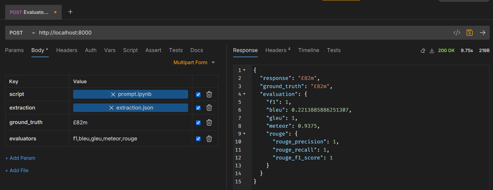

# Evaluation Runtime

This repository contains a simple Python execution and evaluation engine that can run Python scripts or Jupyter notebooks which make calls to Azure OpenAI and perform evaluation of the output. It does this by dynamically building a Docker image with the necessary dependencies and running the container on an Azure Kubernetes Service instance.

The project uses FastAPI and takes in a single POST request with a file containing the file to be executed. The engine will then execute the file, return the output, and perform the evaluation. A sample notebook and extraction file are included in the `resources/samples` directory.

The inputs for each request are as follows:

- `script`: The file to be executed (either a Python script or Jupyter notebook) that contains the prompt and the code to be executed.
- `extraction`: The JSON file containing the extracted content to be used as context for the inference.
- `ground_truth`: The ground truth value to be used for evaluation.
- `evaluators`: The list of evaluators to be used for evaluation. The available evaluators are `f1`, `bleu`, `gleu`, `meteor`, and `rouge`.

You can run the API by using the following `curl` command:

```bash
curl --request POST \
  --url http://localhost:8000/ \
  --header 'content-type: multipart/form-data' \
  --form 'script=@resources/samples/prompt.ipynb' \
  --form 'extraction=@resources/samples/extraction.json' \
  --form 'ground_truth=£82m' \
  --form 'evaluators=f1,bleu,gleu,meteor,rouge'
```
Or you could run the request using a tool such as Bruno or Postman:



## Prerequisites

- Azure CLI (installed locally)
- Docker (installed locally)
- Azure Kubernetes Service (AKS)
- Azure Container Registry (ACR)

## Setup

Copy the `.env.example` file to `.env` and fill in the necessary values for the required Azure services.

Run `poetry install` to install the required dependencies.

## Running the Engine in Visual Studio Code

Run the following command to start the FastAPI server by pressing `F5` in Visual Studio Code. This will run the using your personal identity.

## Running the Engine in Docker

To run the engine in Docker, you will need to build the Docker image and run the container. You also need to supply environment variables in a `.env` file. These environment variables also need to include Azure credentials for a Service Principal with the necessary permissions to access the Azure services.

Run the following command to build the Docker image:

```bash
docker buildx -t evaluation-runtime:latest .
```

Run the following command to start the Docker container:

```bash
docker run -it -p 8000:8000 -v /var/run/docker.sock:/var/run/docker.sock --env-file .env evaluation-runtime:latest
```